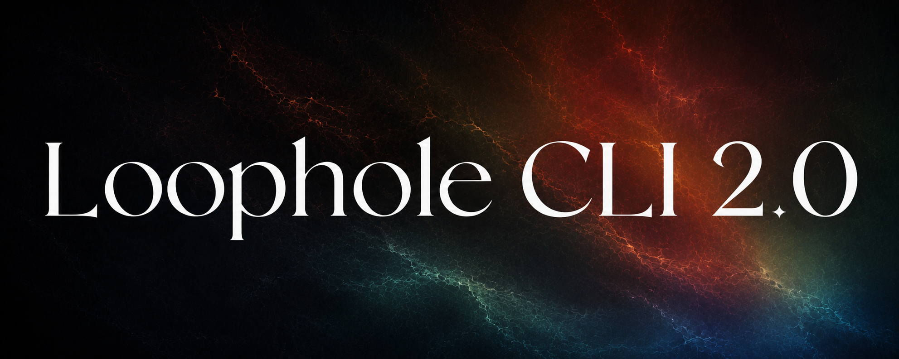
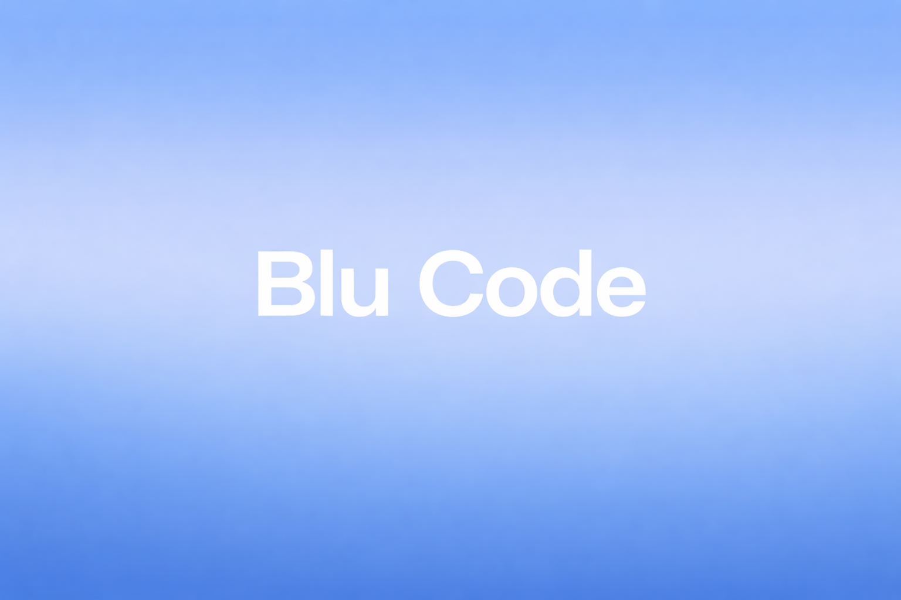

<p align="center">
  
</p>

<h1 align="center">Loophole</h1>

<p align="center">
The open-source AI-assisted coding tool for your terminal.
</p>

<div align="center">


</div>

<div align="center">

<div align="center">
<table>
<tbody>
<td align="center">
<a href="https://github.com/loophole-ai/loophole-cli" target="_blank"><strong>GitHub</strong></a>
</td>
<td align="center">
<a href="./docs/introduction.md" target="_blank"><strong>Documentation</strong></a>
</td>
<td align="center">
<a href="#contributing" target="_blank"><strong>Contributing</strong></a>
</td>
<td align="center">
<a href="https://github.com/loophole-ai/loophole-cli/issues" target="_blank"><strong>Issues</strong></a>
</td>
<td align="center">
<a href="https://github.com/loophole-ai/loophole-cli/discussions" target="_blank"><strong>Discussions</strong></a>
</td>
</tbody>
</table>
</div>

</div>

<br>

<p align="center">
  
</p>

## Overview

Loophole is a Go-powered terminal UI that transforms your command line into an intelligent development environment. It connects to leading AI models and provides them with powerful tools to read, analyze, and modify your codebase — all from an elegant TUI built with [Bubble Tea](https://github.com/charmbracelet/bubbletea).

<p align="center">
  
</p>

**Key capabilities:**

- Chat with AI models that can see and edit your files
- Execute bash commands through AI suggestions
- Apply complex code refactors automatically
- Get real-time LSP diagnostics and code intelligence
- Manage multiple conversation sessions with full context
- Use Model Context Protocol (MCP) servers for extensibility

## Features

**Multi-Model Support** - Switch between Claude, GPT, Gemini, or any OpenAI-compatible endpoint. Use different models for different tasks within the same session.

**Intelligent File Operations** - Glob patterns to find files matching complex patterns, smart grep to search across your codebase with regex, atomic edits to apply precise diffs and patches, and batch operations to modify multiple files in one go.

**Development Tools** - Real-time diagnostics and code intelligence via Language Server Protocol, command execution to run bash commands directly from chat, MCP support to extend with Model Context Protocol servers, and version control awareness that understands your git context.

**Productivity Features** - Session management to switch between multiple conversations (`Ctrl+S`), custom commands to create reusable prompt templates (`Ctrl+K`), auto-compaction for intelligent context window management, SQLite persistence for full local history storage, and an interactive sidebar to visualize file changes in real-time.

---

## Supported Models

| Provider | Models |
|----------|--------|
| Anthropic (Claude) | `claude-3.7-sonnet` (recommended for coding), `claude-3.5-sonnet`, `claude-4.6-opus` |
| OpenAI | `o3-ultra`, `gpt-5.3-codex`, `gpt-4o` |
| Google | `gemini-3-deep-think`, `gemini-2.0-flash`, `gemini-1.5-pro` |
| DeepSeek | `deepseek-v3`, `deepseek-r1` |

---

## Installation

### Prerequisites

- Go 1.21 or higher (only required when building from source)

### Via npm (recommended)

```bash
npm install -g @loophole-ai/loophole-cli
```

### Via raw script

```bash
curl -fsSL https://raw.githubusercontent.com/loophole-ai/loophole-cli/main/install | bash
```

### From source

```bash
# Clone the repository
git clone https://github.com/loophole-ai/loophole-cli.git
cd loophole-cli

# Install dependencies
go mod download

# Build
go build -o loophole

# Run tests
go test ./...

# Install globally
sudo mv loophole /usr/local/bin/
```

### Setup

1. Set your API key(s):

```bash
export ANTHROPIC_API_KEY="your-key-here"
# or OPENAI_API_KEY, GEMINI_API_KEY
```

2. Create a `.loophole.json` config file (optional):

```json
{
  "agents": {
    "coder": {
      "model": "claude-3.7-sonnet",
      "maxTokens": 8192
    }
  },
  "autoCompact": true
}
```

3. Launch Loophole:

```bash
loophole
```

---

## Usage

### Basic Workflow

1. **Start a conversation** - Launch `loophole` and ask a question
2. **Let AI explore** - Loophole can read files, search your codebase, and understand context
3. **Review changes** - See proposed file modifications in the sidebar
4. **Apply or reject** - Accept changes you want, skip the rest

---

## Keyboard Shortcuts

### Global Shortcuts

| Shortcut | Action |
|----------|--------|
| `Ctrl+C` | Quit application |
| `Ctrl+?` | Toggle help dialog |
| `?` | Toggle help dialog (when not in editing mode) |
| `Ctrl+L` | View logs |
| `Ctrl+S` | Switch session |
| `Ctrl+K` | Command dialog |
| `Ctrl+O` | Toggle model selection dialog |
| `Ctrl+P` | Toggle provider selection (API key configuration) |
| `Esc` | Close current overlay/dialog or return to previous mode |

### Chat Page Shortcuts

| Shortcut | Action |
|----------|--------|
| `Ctrl+N` | Create new session |
| `Ctrl+X` | Cancel current operation/generation |
| `i` | Focus editor (when not in writing mode) |
| `Esc` | Exit writing mode and focus messages |

### Editor Shortcuts

| Shortcut | Action |
|----------|--------|
| `Ctrl+S` | Send message (when editor is focused) |
| `Enter` or `Ctrl+S` | Send message (when editor is not focused) |
| `Ctrl+E` | Open external editor |
| `Esc` | Blur editor and focus messages |

### Session Dialog Shortcuts

| Shortcut | Action |
|----------|--------|
| `↑` or `k` | Previous session |
| `↓` or `j` | Next session |
| `Enter` | Select session |
| `Esc` | Close dialog |

### Model Dialog Shortcuts

| Shortcut | Action |
|----------|--------|
| `↑` or `k` | Move up |
| `↓` or `j` | Move down |
| `←` or `h` | Previous provider (within model dialog) |
| `→` or `l` | Next provider (within model dialog) |
| `Esc` | Close dialog |

### Provider & API Key Dialog Shortcuts

| Shortcut | Action |
|----------|--------|
| `↑` / `↓` | Move up/down |
| `Enter` | Select provider |
| `Esc` | Close dialog |
| `Enter` | Save API key (input) |

### Permission Dialog Shortcuts

| Shortcut | Action |
|----------|--------|
| `←` or `left` | Switch options left |
| `→` or `right` or `tab` | Switch options right |
| `Enter` or `space` | Confirm selection |
| `a` | Allow permission |
| `A` | Allow permission for session |
| `d` | Deny permission |

### Logs Page Shortcuts

| Shortcut | Action |
|----------|--------|
| `Backspace` or `q` | Return to chat page |

---

## Configuration

Place `.loophole.json` in your home directory (`~/.loophole.json`) or project root:

```json
{
  "agents": {
    "coder": {
      "model": "claude-3.7-sonnet",
      "maxTokens": 8192,
      "temperature": 0.7
    },
    "summarizer": {
      "model": "gpt-4o-mini",
      "maxTokens": 2048
    }
  },
  "autoCompact": true,
  "mcpServers": {
    "filesystem": {
      "command": "npx",
      "args": ["-y", "@modelcontextprotocol/server-filesystem", "/path/to/allowed"]
    }
  }
}
```

### Environment Variables

| Variable | Purpose |
|----------|---------|
| `ANTHROPIC_API_KEY` | Claude API access |
| `OPENAI_API_KEY` | GPT-4 API access |
| `GEMINI_API_KEY` | Gemini API access |
| `LOOPHOLE_DEBUG=true` | Enable debug logging |
| `LOOPHOLE_CONFIG=/path/to/.loophole.json` | Custom config location |

---

## Project Structure

Comprehensive documentation is available in the `docs/` directory:

- [Introduction](docs/introduction.md)
- [Getting Started](docs/getting-started.md)
- [Configuration](docs/configuration.md)
- [Key Bindings](docs/key-bindings.md)
- [Architecture](docs/architecture/overview.md)

### Detailed Features

- [AI Chat](docs/features/ai-chat.md)
- [File Operations](docs/features/file-operations.md)
- [LSP Intelligence](docs/features/lsp-and-intelligence.md)
- [MCP Servers](docs/features/mcp-servers.md)
- [Session Management](docs/features/session-management.md)

### Guides

- [Best Practices](docs/guides/best-practices.md)
- [Troubleshooting](docs/guides/troubleshooting.md)

---

## Troubleshooting

**Loophole won't start**
- Check your API keys are set
- Verify Go 1.21+ is installed
- Try `loophole --debug` for detailed logs

**AI can't see my files**
- Ensure you're running Loophole from your project directory
- Check file permissions
- Verify paths in error messages

**Context window errors**
- Enable `autoCompact` in config
- Start a new session for fresh context
- Use more concise prompts

---

## Contributing

We welcome contributions from the community.

1. Fork the repository
2. Create your feature branch (`git checkout -b feature/amazing-feature`)
3. Commit your changes (`git commit -m 'Add amazing feature'`)
4. Push to the branch (`git push origin feature/amazing-feature`)
5. Open a Pull Request

---

## Documentation

- [Introduction](docs/introduction.md) - Overview and core concepts
- [Getting Started](docs/getting-started.md) - Installation and first steps
- [Configuration](docs/configuration.md) - Full configuration reference
- [Architecture](docs/architecture/overview.md) - Technical overview
- [Troubleshooting](docs/guides/troubleshooting.md) - Common issues and fixes

---

## Credits

Loophole builds on the excellent work of many open-source projects:

- **[Bubble Tea](https://github.com/charmbracelet/bubbletea)** - Excellent TUI framework
- **[Lip Gloss](https://github.com/charmbracelet/lipgloss)** - Style definitions for TUI
- **[Go-GitHub](https://github.com/google/go-github)** - GitHub API client
- **[Sqlite3](https://github.com/mattn/go-sqlite3)** - Local persistence

---

## License

Loophole is licensed under the **MIT License**. See [LICENSE](./LICENSE) for the full license text.

This project is a rebranded fork of the upstream `blu-code` project. See [NOTICE.md](./NOTICE.md) for attribution details.

---

<div align="center">

**Garv Agnihotri** — Open Source • AI-Powered Terminal Coding

</div>
